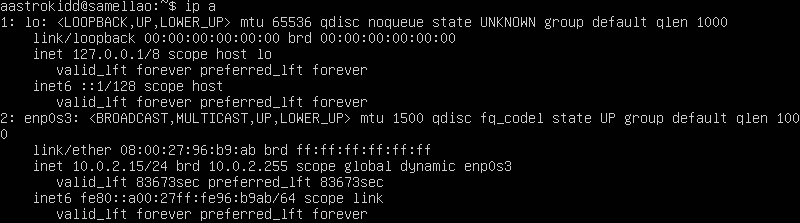
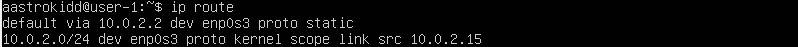

## Part 1. Установка ОС

- *результат выполнения команды `cat /etc/issue` содержит информацию о текущей версии установленной системы*  

## Part 2. Создание пользователя

- *команда для создания нового пользователя; флаг g, чтобы добавить нового пользователя в группу `adm`*  

- *результат вывода команды `cat /etc/passwd`, новый пользователь на последней строке* 

## Part 3. Настройка сети ОС

- *изменила статическое имя машины на user-1 и проверила, что имя изменилось* 

- *установила временную зону соответствующую моему текущему расположению (Москва)*  

- *вывела названия сетевых интерфейсов с помощью консольной команды `ip`, флаг `а` - all*  

`Интерфейс lo` (loopback) - это виртуальный сетевой интерфейс, который используют для подключения приложений и процессов на одном компьютере к другим приложениям и процессам. На Unix-подобрых системах присутствует по умолчанию и обычно имеет имя lo. Наиболее широко используемый IP адрес в механизмах loopback — 127.0.0.1.

- *вывела ip адрес устройства от DHCP сервера* 
  

DHCP (англ. Dynamic Host Configuration Protocol — протокол динамической настройки узла) — сетевой протокол, позволяющий сетевым устройствам автоматически получать IP-адрес и другие параметры, необходимые для работы в сети TCP/IP. Данный протокол работает по модели «клиент-сервер». 

- определила и вывела внешний ip-адрес шлюза (ip) - 185.61.78.21 и внутренний IP-адрес шлюза, он же ip-адрес по умолчанию (gw) - 10.0.2.2 
  *внешний ip-адрес* 
   *внутренний ip-адрес* 
  

- Задала статичные (заданные вручную, а не полученные от DHCP сервера) настройки ip, gw, dns (используя публичные DNS серверы, например 1.1.1.1 или 8.8.8.8). DHCP автоматически присваивает устройству IP, поэтому сначала необходимо отключить облачную инициализацию. 
  *открыла файл конфигурации через команду `sudo nano /etc/cloud/cloud.cfg.d/subiquity-disable-cloudinit-networking.cfg`*  
  *открыла файл конфигурации netplan в текстовом редакторе nano с помощью команды: `sudo nano /etc/netplan/00-installer-config.yaml`*  
 *задала статические настройки сети: изменила значение параметра dhcp4 на false, в addresses указала статический IP-адрес: 10.0.2.15/24, и в gateway4 зададим внутренний IP-адрес 10.0.2.2; в параметре addresses раздела nameservers указала публичные серверы.*  
 *для применения изменений использовала команду `sudo netplan apply`*   

- *после перезагрузки виртуальной машины командой `ip route` проверила сохранились ли выставленные вручную настройки (тип изменился на static)*  
 *пропинговала удаленный хост `ya.ru`*  *пропинговала удаленный хост `1.1.1.1`* 

## Part 4. Обновление ОС
- *для обновления системы до последней на момент выполнения задания версии использовала команды `sudo apt update` и `sudo apt upgrade`*
- *после обновления системных пакетов, проверила отсутствие новых обновлений:*
 

## Part 5. Использование команды sudo
Утилита `sudo` (substitute user and do — дословно «подменить пользователя и выполнить») —  это утилита для операционных систем семейства Linux, позволяющая пользователю запускать программы с привилегиями другой учётной записи, как правило, суперпользователя root. Смысл выполнения команды от root в том, что у него повышенные права доступа и, применяя sudo, обычный пользователь может выполнить те действия, на которые у него недостаточно прав.

 - чтобы поменять hostname ОС от имени пользователя, созданного в пункте Part 2 (используя sudo), необходимо сначала разрешить пользователю `cucumber` пользоваться командой `sudo`. Ввела команду для управления пользователями Linux и добавила пользователя в группу sudo: `sudo usermod -aG sudo cucumber` (флаг G позволяет указать список дополнительных групп, в которые должен входить пользователь. Флаг а позволяет добавлять новые дополнительные группы, не удаляя старые)
  

 - сменила текущего пользователя на пользователя cucumber с помощью команды `su`
   

 - Для того чтобы изменить hostname на `cucumber` использовала команду `hostnamectl set-hostname cucumber`. Для проверки результата изменения ввела команду `hostname`. 
  

 ## Part 6. Установка и настройка службы времени
 - С помощью команды `date` вывела текущее время системы, далее воспользовалась командой ` timedatectl show`, как видно из вывода команды протокол синхронизации времени (NTP) активен:
   

## Part 7. Установка и использование текстовых редакторов

- выполнила установку текстовых редакторов командами `sudo apt install vim`, `sudo apt install nano` и `apt install mcedit`

#### Изменение файла c сохранением изменений

- `VIM`   выполнила команду `vim test_vim.txt`, для начала ввода текста нажала клавишу `I` (insert). для закрытия файла с сохранением изменений использовала сочетание клавиш `ESC + :wq`
   

- `NANO`   выполнила команду `nano test_nano.txt`. для закрытия файла с сохранением изменений использовала команды `^O` и `^X`
   

- `mcedit`   выполнила команду `mcedit test_mcedit.txt`. для закрытия файла с сохранением изменений использовала команды `F2` и `F10`
   

#### Изменение файла без сохранения изменений

- `VIM`   снова выполнила команду `vim test_vim.txt`, для начала ввода текста нажала клавишу `I` (insert). для закрытия файла без сохранения изменений использовала сочетание клавиш `ESC + :q!`
   

- `NANO`   выполнила команду `nano test_nano.txt`. для закрытия файла без сохранения изменений использовала команду `^X`
   

- `mcedit`   выполнила команду `mcedit test_mcedit.txt`. для закрытия файла без сохранения изменений использовала команду `F10`
   

#### Поиск и замена слова

- `VIM`   снова выполнила команду `vim test_vim.txt`. для поиска по содержимому использовала сочетание клавиш `ESC + /samellao`.
   
для замены было использовано сочетание `:s/samellao/21 School 21` 
   

- `NANO`   снова выполнила команду `nano test_nano.txt`. для поиска по содержимому использовала команду `^W`.
   
для замены было использовано сочетание `^W` -> `^R` + `samellao` + `21 School 21` 
   

- `mcedit`   снова выполнила команду `mcedit test_mcedit.txt`. для поиска по содержимому использовала команду `F7`
   
для замены была использована команда `F4`
  
   

## Part 8. Установка и базовая настройка сервиса SSHD

- для установки службы SSHd использовала команды `sudo apt-get install ssh` и `sudo apt install openssh-server` 
   
- добавила автостарт службы при загрузке системы при помощи команды `sudo systemctl start sshd`
   

- Для перенастройки службы SSHd на порт 2022 внесла изменения в файл `\etc\ssh\sshd_config` (раскоментировала строку port и ввела значение 2022)
   

- для того, чтобы проверить наличие ssh процесса, использовала команду `ps -e`, в команде `ps` опция `-e` выводит все запущенные процессы.
   

#### команда ps показывает запущенные процессы, выполняемые пользователем в окне терминала;

ключи:
  `-e` или `-A` чтобы просмотреть все запущенные процессы;
  `-d` чтобы показать все процессы, кроме лидеров сессии;
  `-d` `-N` можно инвертировать вывод с помощью переключателя -N. Например, если хочу вывести только лидеров сеансов;
  `T` увидеть только процессы, связанные с этим терминалом;
  `r` просмотреть все работающие (running) процессы;
  `-p 'pid'` если знать идентификатор процесса PID, можно просто использовать следующую команду, для вывода процесса с этим 'pid';
  `U 'userlist'` найти все процессы, выполняемые конкретным пользователем;
  `-ef` получить полный список;

- для перезагрузки системы использовала команду `reboot`

- для получения сведений о состоянии сетевых соединений и слушаемых на данной машине портах ТСХ и UPD использовала команду `netstat -tan`. Вывод команды  должен содержать tcp 0 0 0.0.0.0:2022 0.0.0.0:* LISTEN
   

значение ключей -tan:
 `-t` — отображение текущего подключения в состоянии переноса нагрузки с процессора на сетевой адаптер при передаче данных;
 `-a` — отображение всех подключений и ожидающих портов;
 `-n` — отображение адресов и номеров портов в числовом формате;

`proto` - имя порта, `Recv-Q` - количество байтов, помещенных в буфер обмена приема TCP/IP (не переданных), `Send-Q` - количество байтов помещенных в буфер отправки TCP/IP (не отправленных), `Local Adress` - локальный адрес, `Foreign Address` - внешний адрес, `State` - состояние.

Значение Foreign Addres `0.0.0.0` - это специальный IP-адрес, известный как "маршрут по умолчанию" или "неуказанный адрес". Он используется для указания того, что трафик должен отправляться на все интерфейсы компьютера, независимо от их индивидуальных IP-адресов.

## Part 9. Установка и использование утилит top, htop

### TOP
Утилита `top` — это консольный диспетчер задач. Он показывает общую информацию о системе и информацию о каждом процессе. 
  

- uptime = 43 min
- количество авторизованных пользователей = 1
- общая загрузка системы 0,00 0,00 0,00
- количество процессоров 97 (1 используется, 96 в режиме сна)
- загрузка CPU 99.3% времени простаивания CPU; 0,3% времени запуска ядра (sy); 0,3% времени затрачено на обслуживание программных прерываний на уровне ядра (si)
- загрузка оперативной памяти - используется 143,5 (всего 1971,6 МиБ)
- загрузка памяти подкачки - используется 0 (всего 1481 МиБ)
- `1` - pid процесса занимающего больше всего памяти
- `13` - pid процесса, занимающего больше всего процессорного времени

### HTOP

 Утилита `htop` — это консольный и интерактивный диспетчер задач, который похож на уже рассмотренный выше top.

- Сортировка по PID:
 

- Сортировка по PERCENT_CPU
 

- Сортировка по PERCENT_MEM
 

- Сортировка по TIME
 

- Фильтр по процессу sshd
 

- Поиск процессора syslog
 

- Вывод hostname, clock и uptime
 

## Part 10. Использование утилиты fdisk

`fdisk` - интерактивная консольная утилита, которая может создать таблицу разделов и разделы на жестком диске и управлять ими. 

- Результат выполнения `fdisk -l` приведен на скриншоте ниже:
 
 Название: /dev/sda
 Размер: 10 GiB
 Количество секторов: 20971520
 Размер swap: 1,8G

## Part 11. Использование утилиты df

Утилита `df` - показывает список всех файловых систем по именам устройств, сообщает их размер, занятое и свободное пространство и точки монтирования.

- Результат вывода `df /`
 
 Размер раздела - 8408452 килобайт
 Размер занятого пространства - 4784292 килобайт
 Размер свободного пространства - 3175444 килобайт
 Процент использования - 61%

- Результат вывода `df -Th /`
 
 Размер раздела - 8.1G
 Размер занятого пространства - 4.6G
 Размер свободного пространства - 3.1G
 Процент использования - 61%
 Тип файловой системы ext4

## Part 12. Использование утилиты du

Утилита `du` - стандартная Unix-программа для оценки занимаемого файлового пространства.

- результат вывода размера папок /home, /var, /var/log сначала в байтах `sudo du -bs /home /var/log/ /var`(опция -b --bytes), затем в человекочитаемом виде `sudo du -hs /home /var/log/ /var`(опция -h --human-readable), затем и в том, и в том, но совместно эти два флага не совсем корректно отрабатывают `sudo du -bhs /home /var/log/ /var`
 

- размер всего содержимого в /var/log (не общее, а каждого вложенного элемента, используя *) `sudo du /var/log/*`
 
 

## Part 13. Установка и использование утилиты ncdu

Утилита `ncdu` - это псевдографическая утилита, которая работает в терминале Linux. Она отображает список файлов и директорий по объёму и позволяет удалять ненужные файлы.

- установка с помощью команды `sudo apt install ncdu`
- размер папки /home
 

- размер папки /var
 

- размер папки /var/log
 

## Part 14. Работа с системными журналами

- /var/log/dmesg
 

- /var/log/syslog
 

- /var/log/auth.log
 
 время последней успешной авторизации - 18:47:54
 имя пользователя - aastrokidd
 метод входа в систему - tty1 LOGIN

- перезапустила службу SSHd с помощью команды `sudo systemctl restart ssh` 
 

## Part 15. Использование планировщика заданий CRON

`Cron` – это планировщик задач. Если подробнее, то это утилита, позволяющая выполнять скрипты на сервере в назначенное время с заранее определенной периодичностью.

- с помощью команды `crontab -e` открыла конфигурационный файл и внесла туда новую команду `uptime`, которая будет вызываться через каждые 2 минуты.
 

- вывела данные из системного журнала с помощью команды `tail /var/log/syslog`, чтобы найти там строчки (минимум две в заданном временном диапазоне) о выполнении;
 

- вывела список текущих заданий для CRON с помощью команды `crontab -l` 
 

- удалила все задания из планировщика заданий с помощью команды `crontab -r` и вывела список текущих заданий для CRON повторно
 
